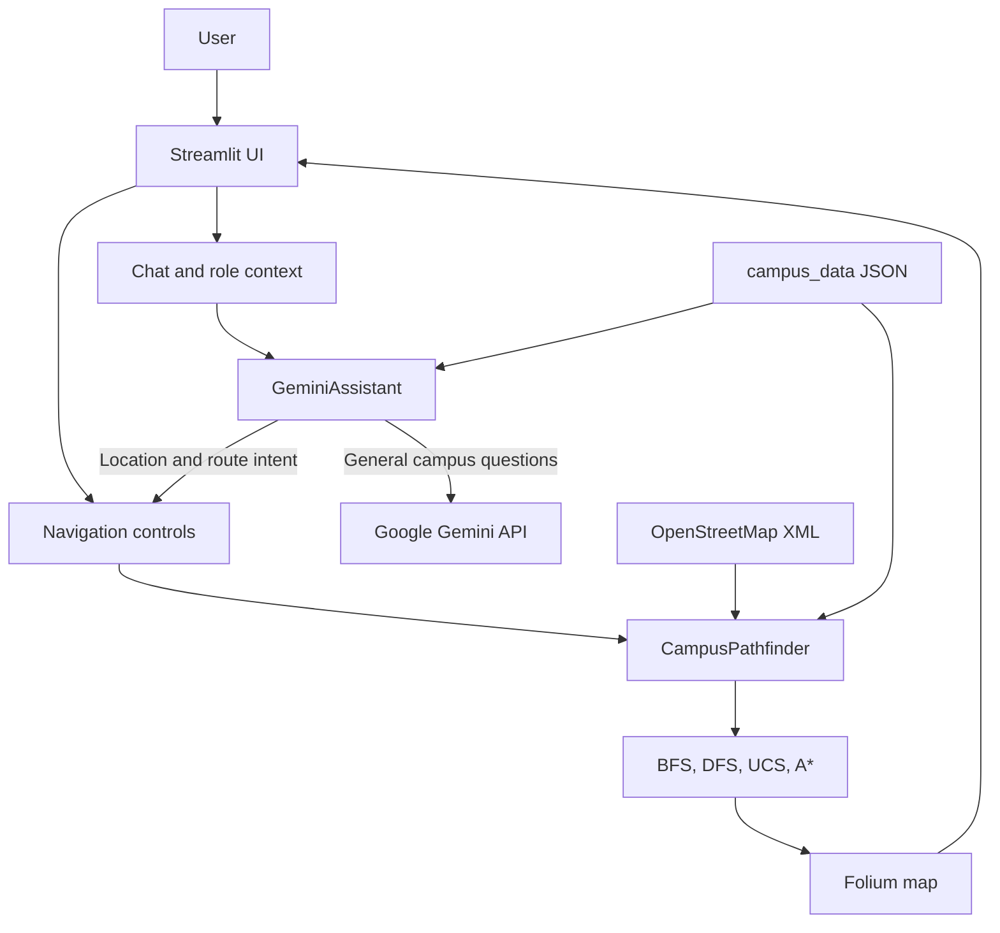

# CampusAI

## Inclusive Smart-Campus Navigation Copilot

[](https://www.python.org/)
[](https://streamlit.io/)
[](https://ai.google.dev/)
[](https://render.com/)

**CampusAI turns a static campus map into an intelligent, inclusive, and actionable navigation assistant.** Users can ask questions in natural language, find facilities, calculate walking routes, and view the result on an interactive map. The experience can be adapted for students, faculty, visitors, security, maintenance, and support staff.

| Resource | Link |
| --- | --- |
| Live application | [smartcampus-docker.onrender.com](https://smartcampus-docker.onrender.com) |
| Source repository | [github.com/jothikrishna1709-coder/CampusAI](https://github.com/jothikrishna1709-coder/CampusAI) |
| Judge demonstration script | [`hackathon_judge_script.md`](hackathon_judge_script.md) |
| Health endpoint | [`/_stcore/health`](https://smartcampus-docker.onrender.com/_stcore/health) |

## Why CampusAI

Campus navigation is often fragmented across static PDFs, unfamiliar building names, and disconnected information sources. CampusAI addresses this problem by combining conversational assistance with graph-based route planning. A user can ask, “How do I get from the Main Gate to the Library?” and receive both a helpful explanation and a visual route.

The project is designed around practical accessibility. Location records include accessibility information, and the navigation view provides an accessible-route mode. The application also retains local location lookup and routing intent parsing when Gemini is unavailable.

## Core capabilities

| Capability | Implementation | User value |
| --- | --- | --- |
| Natural-language assistance | Google Gemini through the Google GenAI SDK | Users can ask campus questions conversationally. |
| Route planning | OpenStreetMap graph with BFS, DFS, UCS, and A* variants | Users receive a calculated path instead of a static list of places. |
| Interactive mapping | Folium rendered through Streamlit-Folium | Routes, markers, explored nodes, distance, and walking time appear together. |
| Role-aware responses | Campus role definitions and role-specific prompts | Responses can be tailored to the user’s context. |
| Accessibility support | Accessibility metadata and route toggle | Users can request an accessibility-aware route. |
| Map layers | OpenStreetMap street map, Esri satellite imagery, optional Planet layer | Users can switch between practical street and imagery views. |
| Deployment readiness | Dockerfile, Render Blueprint, health endpoint, and environment configuration | The application can be run locally or deployed as a public service. |

## Live demonstration

1. Open the [live application](https://smartcampus-docker.onrender.com).
2. Select **Navigate** from the sidebar.
3. Choose **Main Gate** as the starting point and **Library** as the destination.
4. Select **Route**.
5. Point out the highlighted route, start and destination markers, distance, estimated walking time, and map layer control.
6. Open **Ask CampusAI** and ask: `How do I get from the Main Gate to the Library?`
7. Use the generated navigation action to move from the conversation into the route view.
8. Demonstrate the role selector and the accessible-route toggle.

A longer judge-facing walkthrough is available in [`hackathon_judge_script.md`](hackathon_judge_script.md).

## Architecture



The application loads campus road geometry from `attached_assets/sathyabama_small.osm`. It loads campus locations and roles from `campus_data/`. The pathfinder snaps POI coordinates to the road graph, calculates a route, and adds the route and markers to a Folium map. Streamlit then renders the map and route metrics in the browser.

## Technology stack

| Layer | Technology |
| --- | --- |
| User interface | Streamlit |
| Map rendering | Folium and Streamlit-Folium |
| Road graph | OSMnx, NetworkX, and OpenStreetMap XML |
| AI assistant | Google Gemini via `google-genai` |
| Configuration | Environment variables and Render service secrets |
| Packaging | `uv` and `uv.lock` |
| Deployment | Docker on Render |
| Testing | Pytest and Python compilation checks |

## Local setup

### Prerequisites

- Python 3.11 or newer
- [`uv`](https://docs.astral.sh/uv/) recommended
- A Gemini API key only if Gemini-powered general answers are required

### Install and run

```bash
git clone https://github.com/jothikrishna1709-coder/CampusAI.git
cd CampusAI
uv sync --frozen
uv run streamlit run app.py
```

The application normally starts at `http://localhost:8501`.

### Optional environment variables

Copy `.env.example` to `.env` for local development, or export variables directly. Never commit real keys.

| Variable | Required | Purpose |
| --- | --- | --- |
| `GEMINI_API_KEY` | No | Enables Gemini-powered general campus answers. |
| `GEMINI_MODEL` | No | Gemini model identifier. The current default is `gemini-3.5-flash-lite`. |
| `PLANET_API_KEY` | No | Authenticates Planet Basemaps requests. |
| `PLANET_MOSAIC_ID` | No | Enables the optional Planet tile layer for an authorized mosaic. |

Example for macOS or Linux:

```bash
export GEMINI_API_KEY="your-gemini-api-key"
export GEMINI_MODEL="gemini-3.5-flash-lite"
uv run streamlit run app.py
```

Example for Windows PowerShell:

```powershell
$env:GEMINI_API_KEY = "your-gemini-api-key"
$env:GEMINI_MODEL = "gemini-3.5-flash-lite"
uv run streamlit run app.py
```

## Testing

The repository currently passes **14 automated tests** covering assistant behavior, role-compatible calls, fuzzy location matching, route algorithms, production POI distances, map layers, and invalid input handling.

```bash
uv run pytest -q
uv run python -m compileall -q app.py src
git diff --check
```

The route regression test verifies that a production route has a nonzero distance and that the rendered map includes a street layer, satellite layer, and Folium layer control.

## Render deployment

The repository includes a Docker-based [`render.yaml`](render.yaml) Blueprint and a production [`Dockerfile`](Dockerfile). The Docker image copies the application code, campus data, map assets, and Streamlit configuration. The container honors Render’s `PORT` variable and exposes the Streamlit health endpoint at `/_stcore/health`.

To deploy your own instance:

1. Fork or connect this repository in Render.
2. Create a Blueprint deployment from `render.yaml`, or create a Docker web service using the repository root and `Dockerfile`.
3. Add secrets through Render environment variables.
4. Deploy the `main` branch.
5. Verify `https://your-service.onrender.com/_stcore/health` returns `ok`.

## Planet imagery status

The map always provides a reliable OpenStreetMap street layer and an Esri satellite layer. Planet imagery is implemented as an optional layer and requires both a Planet API key and an authorized Planet mosaic ID.

The repository includes [`list_planet_mosaics.py`](list_planet_mosaics.py), which calls Planet’s Basemaps API and lists accessible mosaic IDs without printing the API key. Planet account access is plan- and Area-of-Access-dependent. If the API returns no mosaics, the application continues to use the reliable street and Esri layers rather than claiming that Planet imagery is active.

```bash
export PLANET_API_KEY="your-planet-api-key"
python3 list_planet_mosaics.py
```

After selecting an authorized mosaic, configure:

```text
PLANET_API_KEY=your-planet-api-key
PLANET_MOSAIC_ID=your-authorized-mosaic-id
```

## Project structure

| Path | Purpose |
| --- | --- |
| `app.py` | Streamlit application entry point |
| `src/ai_assistant.py` | Role-aware assistant, location matching, and Gemini integration |
| `src/pathfinding.py` | OSM graph loading, route algorithms, and Folium map creation |
| `src/ui/` | Home, navigation, chat, facilities, and sidebar views |
| `campus_data/` | Campus location and role definitions |
| `attached_assets/` | OSM campus graph files and supporting assets |
| `tests/` | Automated regression tests |
| `Dockerfile` | Production container definition |
| `render.yaml` | Render deployment Blueprint |
| `hackathon_judge_script.md` | Judge-facing presentation and demo script |

## Security and responsible use

API keys are stored in local environment variables or Render secrets. They are not required in source code and must never be committed to GitHub. If a key has been exposed, rotate it through the relevant provider and update only the secure deployment environment.

CampusAI provides route guidance based on the available campus graph and data. Users should follow campus signage, accessibility guidance, and local safety instructions when routes differ from current conditions.

## License

This project is licensed under the MIT License. See [`LICENSE`](LICENSE).

## References

[1]: https://www.python.org/ "Python"
[2]: https://streamlit.io/ "Streamlit"
[3]: https://ai.google.dev/ "Google Gemini API"
[4]: https://docs.planet.com/develop/apis/basemaps/ "Planet Basemaps API"
[5]: https://osmnx.readthedocs.io/ "OSMnx documentation"
[6]: https://python-visualization.github.io/folium/ "Folium documentation"
